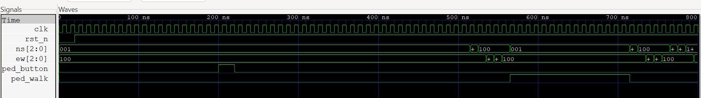

# 🚦 Traffic Light Controller FSM (Verilog)  
A fully functional traffic light controller designed in Verilog using a **Moore FSM**, simulated using **Icarus Verilog** and **GTKWave**.

This version includes a **Pedestrian Button Feature**:
- A pedestrian can request crossing by pressing a button.
- The request is latched and served during the next **North–South Green** phase.
- An extended green interval is generated for pedestrian safety (`ped_walk` signal).
- Tested with a dedicated testbench.

---

## 📁 Project Structure
traffic-light-fsm\
├── traffic_light.v # Main FSM with pedestrian support\
├── tb_traffic.v # Testbench\
├── dump.vcd # Waveform dump (sim output)\
└── screenshots\
└── waveform.png # Waveform screenshot\

---

## 🧠 FSM States  
0 → NS_GREEN\
1 → NS_YELLOW\
2 → ALL_RED\
3 → EW_GREEN\
4 → EW_YELLOW\
5 → ALL_RED2\

Pedestrian request (`ped_button`) is latched and extends the NS green period.

---

## ▶️ How to Run

### **1. Compile**
iverilog -o sim.vvp tb_traffic.v traffic_light.v

### **2. Run**
vvp sim.vvp

### **3. View Waveform**
gtkwave dump.vcd

---

## 📡 Waveform Example  
Below is a waveform showing clock, reset, NS/EW lights, pedestrian button, and walk interval:

---

## 🔧 Tools Used  
- **Icarus Verilog** for simulation  
- **GTKWave** for waveform analysis  
- **GitHub** for version control  
- **Windows CMD / WSL** (mixed development)

---

## ⭐ Learning Outcomes  
- Designing Moore FSMs  
- Handling asynchronous inputs (pedestrian button)  
- Implementing request latching logic  
- Creating Verilog testbenches  
- Using GTKWave effectively  
- Structuring a hardware project professionally

---

## 📌 Author  
Shagun Gupta — Electronics & Communication Engineering (ECE), VIT Chennai  
